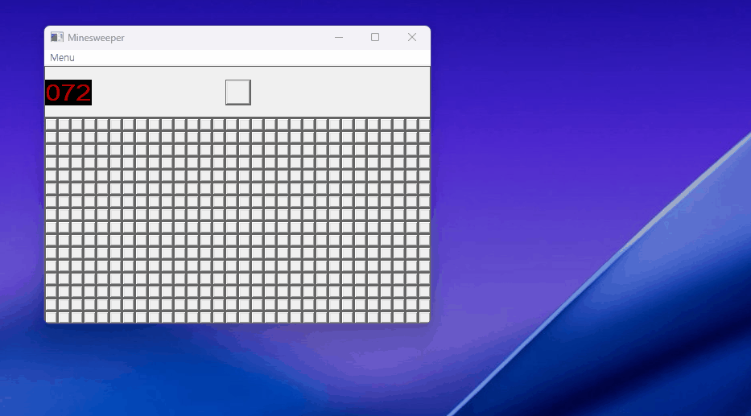

# 📌 Minesweeper 
Windows Legacy API를 이용한 지뢰찾기 모작입니다. 
이 프로젝트는 MIT 라이선스 하에 제공되어 누구나 자유롭게 사용, 수정, 배포할 수 있습니다. 개인 또는 상업적 용도로도 활용이 가능합니다. 
  
## 📝 Description 
"Minesweeper"는 고전 게임인 지뢰찾기를 모작한 것입니다. 
버튼 컨트롤을 서브 클래싱하여 셀로 활용하였으며, 간단한 규칙만 적용하여 지뢰찾기 프로그램을 구현했습니다. 
이미지의 경우 디테일할 필요가 없어 삭제할 부분은 삭제하고 지뢰와 깃발 비트맵만 제작했습니다. 
외부 리소스없이 순수 API 코드로만 작성되어 조금 복잡해 보일 수 있으나 이벤트 순서와 트리거 등을 이해하는데에는 큰 도움이 될 것입니다. 
  
## 🚀 Getting Started 
### 🔧 Dependencies 
Windows 10 이상 
 
### 📥 Installing 
[Releases](https://github.com/stdFrog/Minesweeper/releases) 페이지에서 최신 버전을 확인하실 수 있습니다. 
압축 해제 후 `Minesweeper.exe` 또는 `MinesweeperInstaller.exe`를 실행합니다. 
설치 파일(MinesweeperInstaller.exe)을 다운로드한 경우 안내에 따라 안전하게 실행 파일(Minesweeper.exe)을 설치하시면 됩니다. 
 
### ▶️ Executing program 
- Minesweeper.exe 
  
## ❓ Help 
- 프로그램 실행시 화면 상단에서 메뉴와 지뢰 개수, 초기화 버튼을 확인하실 수 있습니다. 
- 렌더링 로직이 최적화 되지 않아 화면 출력시 시간이 다소 소요될 수 있습니다. 
- 빈 셀을 눌렀을 때 해당 셀을 기준으로 근방의 셀을 탐색하는 동작을 눈으로 확인할 수 있습니다. 이는 의도된 것이며 그리기 구간에서 DC를 잠근 후 모든 탐색이 끝난 다음 DC 잠금을 해제하면 원래의 지뢰찾기와 동일하게 동작합니다. 
  
## 👤 Authors 
- stdsic — @https://github.com/stdsic/Minesweeper 
  
## 📚 Version History 
- 1.0.0 
  - 최초 릴리스 
  
## 🧾 License 
이 프로젝트는 [MIT License](LICENSE)로 라이선스되어 있습니다. 
자세한 정보는 LICENSE 파일을 참고하시기 바랍니다. 
 
